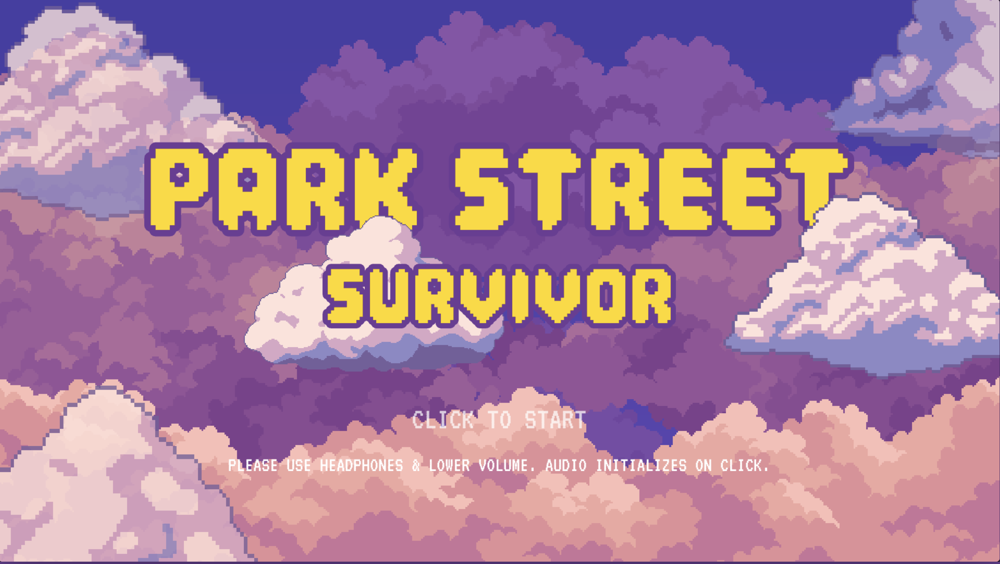
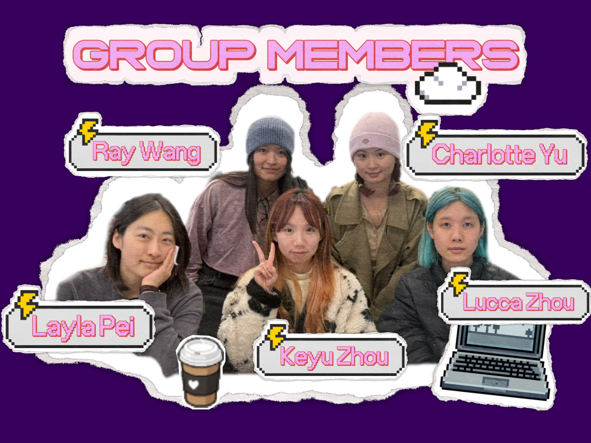

 

# Park Street Survivor

  
  
  

 

  

> *"Sprint through the fragmented memories of a Bristol CS graduate: A 5-day surrealist journey on Park Street where every gift from the past shapes your ultimate choice — to wake up or to fade away."*

 

 

 

<h2 align="center">Group Members</h2>

  

| Role | Name | Email |
|:---:|:---:|:---:|
| **Core Mechanism Designer** | Charlotte Yu | fe22207@bristol.ac.uk |
| **Aesthetic Designer** | Lucca Zhou | pn25381@bristol.ac.uk |
| **Level Designer** | Ray Wang | nz25771@bristol.ac.uk |
| **UI/UX & Audio Designer** | Layla Pei | jj25661@bristol.ac.uk |
| **Scripts Designer** | Keyu Zhou | nq25289@bristol.ac.uk |

 

 

<h2 align="center">Table of Contents</h2>

| # | Section | Description |
|:---:|:---:|:---|
| 00 | [Labs](#labs) | Weekly lab tasks & documentation |
| 01 | [Introduction](#introduction) | Game overview & what makes it novel |
| 02 | [Requirements](#requirements) | Ideation, use cases & user stories |
| 03 | [Design](#design) | System architecture & class diagrams |
| 04 | [Implementation](#implementation) | Key technical challenges |
| 05 | [Evaluation](#evaluation) | Qualitative & quantitative testing |
| 06 | [Process](#process) | Team workflow & reflection |
| 07 | [Evaluation](#conclusion) | Lessons learnt & future work |
| 08 | [Contribution](#contribution) | Individual contributions |

 

 

<h2 align="center">Labs</h2>

| Week | Title | Documentation |
|:---:|:---|:---:|
| 01 | **Lab 1: List of Game Ideas** | [📂 ReadMe](./docs/Labs/Week_1_List_of_Ideas/README.md) |
| 02 | **Lab 2: Paint System & Game Brainstorming** | [📂 ReadMe](./docs/Labs/Week_2_Paint_App/README.md) |
| 07 | **Lab 7: Think Aloud Study & Heuristic Evaluation** | [📂 ReadMe](./docs/Labs/Week_7_Evaluation/README.md) |

 

 

<h2 align="center">Introduction</h2>

Our game is a narrative-driven endless runner that combines fast-paced parkour gameplay with interactive storytelling. The core gameplay is inspired by classic mobile runners such as Temple Run and Subway Surfers, where players must continuously avoid obstacles and manage limited resources while moving forward. However, unlike traditional runner games that focus purely on reflex-based challenges, our game integrates a strong narrative layer and light puzzle elements.

The visual style takes inspiration from the warm pixel-art aesthetics of Stardew Valley and the bold UI presentation of Persona 5. On the narrative side, the story structure draws influence from the psychological tension of Shutter Island and the character-driven storytelling of Persona 5.

The key twist of our game is the integration of story progression within the runner mechanics. Each run represents a fragment of the protagonist’s daily routine, and the player gradually uncovers narrative clues while navigating obstacles. This creates a hybrid experience where movement, exploration, and story discovery are tightly connected.

The story takes place during an ordinary week in Bristol. The protagonist, Iris, begins each day just like any other student: packing her backpack, rushing through crowded streets, avoiding traffic, and trying to reach class before the bell rings. Along the way, she encounters familiar faces, unexpected events, and fragments of hidden stories.

What initially appears to be a normal routine slowly becomes something more mysterious. As the week unfolds, Iris begins to notice that each day may not be as ordinary as it seems. What stories will she uncover, and what choices will she ultimately make?

 

 

<h2 align="center">Requirements</h2>

<i>15% &nbsp;·&nbsp; ~750 words</i>

Early stages design. Ideation process. How did you decide as a team what to develop? Use case diagrams, user stories. 
**2.1 Early Design and Ideation** 

At the beginning of the project, each team member proposed several potential game concepts, including Park Street Survivor, Pico Park, Plants vs Zombies, Tableturf Battle, and The Strongest Support. To evaluate these ideas systematically, the team developed a scoring table that assessed each proposal according to four criteria: creativity, implementation difficulty, gameplay interest, and extensibility. After several rounds of discussion and voting, Park Street Survivor (PSS) was selected as the final concept. Compared with the other proposals, PSS achieved higher scores in originality and long-term expandability, as it represented a completely original game idea rather than a direct adaptation of an existing title.

In addition to the scoring results, practical constraints such as development time, technical feasibility, and the team’s programming experience were also considered during the decision process. A runner-style game was viewed as a manageable structure that allows clear gameplay loops while still providing opportunities for creative design.

The high-level design goal of the project was to create an original game that reflects everyday experiences such as commuting to school or work. The game aims to provide short, low-pressure play sessions that can entertain players during brief breaks, while gradually introducing narrative elements that encourage reflection beyond the immediate gameplay.

After the core concept was established, the team began analysing system requirements by identifying stakeholders and refining gameplay features into epics and user stories.

todo:
- Stakeholers(onion model)
- Epics
- Functional requirements
- Non-function requirements
- User Stories
- Use case diagram

 

 

<h2 align="center">Design</h2>

<i>15% &nbsp;·&nbsp; ~750 words</i>

System architecture. Class diagrams, behavioural diagrams.

 

 

<h2 align="center">Implementation</h2>

<i>15% &nbsp;·&nbsp; ~750 words</i>

Describe implementation of your game, in particular highlighting the **TWO** areas of *technical challenge* in developing your game.

 

 

<h2 align="center">Evaluation</h2>

<i>15% &nbsp;·&nbsp; ~750 words</i>

- One **qualitative** evaluation (of your choice)
- One **quantitative** evaluation (of your choice)
- Description of how code was tested

 

 

<h2 align="center">Process</h2>

<i>15% &nbsp;·&nbsp; ~750 words</i>

<h3>Team Structure and Role Definition</h3>

At the project's inception, we recognized that a clear division of labor was essential to prevent overlapping efforts and ensure accountability. We adopted a specialized role structure, ensuring each member had "ownership" over a specific pillar of the game’s development:

<ul>
<li><strong>Charlotte Yu (Core Mechanism Design):</strong> Focused on the physics engine, character movement, and the implementation of the unique health-depletion system.</li>
<li><strong>Lucca Zhou (Aesthetic Design):</strong> Responsible for the 3D environmental assets, character models, and ensuring a cohesive visual identity across all levels.</li>
<li><strong>Ray Wang (Level Design):</strong> Tasked with the architectural flow of the five levels, balancing the difficulty of obstacle placement with the frequency of power-ups.</li>
<li><strong>Layla Pei (UI/UX & Audio):</strong> Developed the head-up display (HUD), menu navigation, and the soundscape that provides feedback for health loss and coffee collection.</li>
<li><strong>Keyu Zhou (Scripts Design):</strong> Wrote and integrated the narrative sequences that bridge the gap between levels, ensuring the story resonated with the gameplay.</li>
</ul>

<h3>Methodology: Agile and Jira Integration</h3>

To manage our workflow, we adopted an <strong>Agile methodology</strong> centered around two-week sprints. Our primary command center was <strong>Jira</strong>, where we utilized a Kanban board to visualize the lifecycle of every task.

The process began with a comprehensive <strong>Product Backlog</strong>, where we listed every requirement—ranging from "Game Bakcground Art Asset" to "Refactor Narrative System to Data-Driven Architecture." During our sprint planning sessions, we moved high-priority "User Stories" from the backlog into the active sprint. This systematic approach allowed us to:

<ul>
<li><strong>Identify Bottlenecks:</strong> We could immediately see if Aesthetic Design was lagging behind Level Design, which prevented the placement of finalized assets into the game engine.</li>
<li><strong>Maintain Transparency:</strong> Every team member had real-time visibility into their peers' progress, significantly reducing the need for redundant status-update meetings.</li>
</ul>

<strong>Our Kanban Board:</strong> 
<a href="https://charlotteyu47.atlassian.net/jira/software/projects/PSS/boards/100?sprints=71&atlOrigin=eyJpIjoiNzcxZDYxMzk4YTY2NDY2NDhmZWFhZmY3ODliNWUwM2QiLCJwIjoiaiJ9" target="_blank">View our Jira Project here</a>

 

 

<h2 align="center">Conclusion</h2>

<i>10% &nbsp;·&nbsp; ~500 words</i>

Reflect on the project as a whole. Lessons learnt. Reflect on challenges. Future work — describe both immediate next steps for your current game and what you would potentially do if you had the chance to develop a sequel.

 

 

<h2 align="center">Contribution Statement</h2>

| Team Member | Primary Role | Contribution |
|:---:|:---|:---:|
| Charlotte Yu | Core Mechanism Design | 20% |
| Lucca Zhou | Aesthetic Design | 20% |
| Ray Wang | Level Design | 20% |
| Layla Pei | UI/UX & Audio | 20% |
| Keyu Zhou | Scripts Design | 20% |

 

 

&nbsp;

