

# Week 1 Lab: List of Ideas

 

## Description

> The primary objective of Week 1 was **Collective Ideation and Feasibility Analysis**. Our team focused on exploring a wide spectrum of game genres to identify a project that balances creative novelty with technical viability within the p5.js framework.

 

## Catalog

| Member | Proposed Game Concepts |
|:---:|:---|
| **Charlotte Yu** | [Game 1: Elemental Grove Defense](#game-1-elemental-grove-defense)   [Game 2: Park Street Survivor](#game-2-park-street-survivor) |
| **Lucca Zhou** | [Game 3: Balatro](#game-3-balatro)   [Game 4: Pico Park](#game-4-pico-park) |
| **Ray Wang** | [Game 5: Flappy Bird](#game-5-flappy-bird)   [Game 6: Super Mario Bros](#game-6-super-mario-bros)   [Game 7: Tableturf Battle](#game-7-tableturf-battle) |
| **Layla Pei** | [Game 8: Tower at the End](#game-8-tower-at-the-end)   [Game 9: The Strongest Support](#game-9-the-strongest-support) |
| **Keyu Zhou** | [Game 10: Plants vs. Zombies](#game-10-plants-vs-zombies) |
| **Yizhou Pan** | [Game 11: Craft & Life](#game-11-craft--life) |

 

---

## Game 1: Elemental Grove Defense
**Game Type:** Grid-based Strategy, Tower Defense, Synergy Simulation

**Game Prototype**
Carrot Fantasy, Genshin Impact

**Game Description**
Set in a "Cyber-Forest" invaded by a "Mechanical Virus." Players plant "Elemental Flora" (Towers) on a grid to stop mechanical bugs from reaching the "Life Tree." Focus is on Placement Strategy and Synergy.

**Added Ideas**
* Adjacency Synergy System: towers function as nodes in a graph with dynamic attack strategy changes.
* Interactive Terrain Modification: destroying "Old Tech Junk" grants currency and alters terrain properties.

 

  <b>Carrot Fantasy (Grid Strategy & UI Inspiration)</b> 
  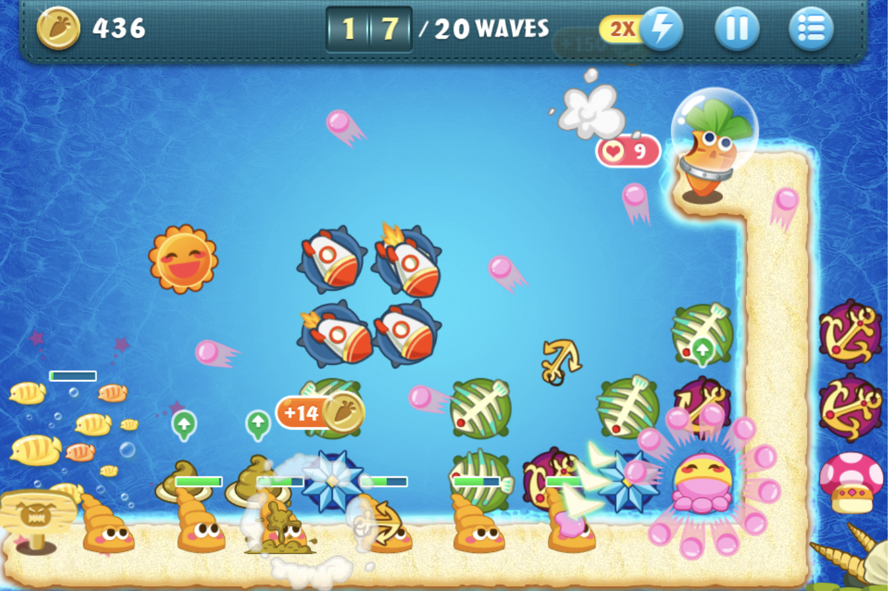

 

  <b>Genshin Impact (Elemental Synergy & Visual Effects)</b> 
  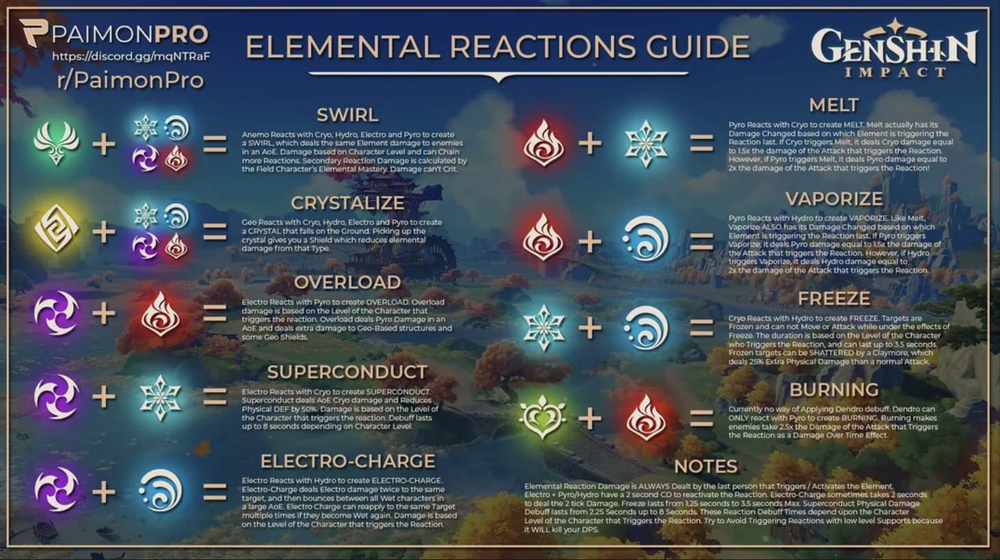

 

**Possible Challenges**
1. Complexity of Interaction Rules - managing elemental combination rules.
2. Graph Traversal for Chain Reactions - implementing "Chain Lightning" with optimized recursive search.

---

## Game 2: Park Street Survivor
**Game Type:** Vertical Scrolling Arcade, Survival Resource Management

**Game Prototype**
* Road Fighter: Vertical scrolling and obstacle avoidance.
* Crossy Road: Grid-based movement and voxel/pixel aesthetic.

**Game Description**
* A satirical survival game simulating the daily struggle of a UoB student trying to reach the Merchant Venturers Building before a 9 AM lecture. (Could be any building -> Multiple maps)
* The game features an infinitely scrolling map of Park Street (a steep hill). The player must navigate through traffic and pedestrians while managing three dynamic stats: Stamina, Mood, and Time.
* The Goal: Survive the climb and reach the top before running out of stats.
* The Struggle: The screen constantly scrolls downwards. If the player is too slow (stopped by obstacles or interactions) and falls off the bottom of the screen, they are "Late" (Game Over).
* The Obstacles: Players must dodge speeding First Buses, erratic Voi Scooters, and slow-walking tourists.
* The Choices: Players encounter random events like a homeless person asking for change or a Tesco offering a Meal Deal. They must decide: risk stopping to interact (restoring Mood/Stamina but losing time).

**Added Ideas**
1. Risk-Reward Interaction Mechanic: Unlike standard arcade games, interacting with shops (Tesco) or NPCs requires the player to stand still in a specific zone for 2 seconds while the screen continues to scroll.
2. Dynamic Weather Physics: The game implements a variable physics engine. When the weather changes to "Bristol Rain", the friction coefficient decreases, causing the player character to slide (inertia) after moving. In "Heavy Rain", visibility is reduced.
3. The "Bristol Item" System: Players can pick up items that change gameplay mechanics using the Strategy Pattern:
    * Voi Scooter: Increases speed by 200% but disables braking (high risk).
    * Broken Umbrella: Provides immunity to "Rain" physics but breaks after 3 hits.
    * Noise-Cancelling Headphones: Automatically ignores negative social events (Promoters/Homeless) but blocks positive audio cues (Car horns).

 

  <b>Road Fighter (Vertical Scrolling & Obstacle Avoidance)</b> 
  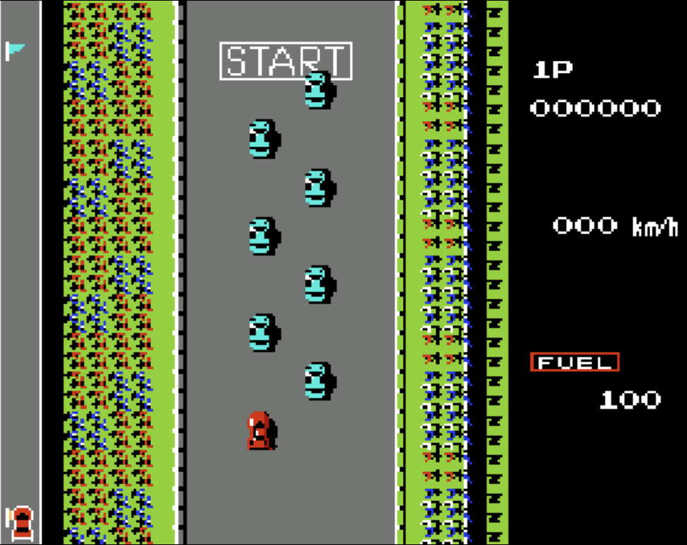

 

  <b>Crossy Road (Voxel Aesthetic & Grid-based Movement)</b> 
  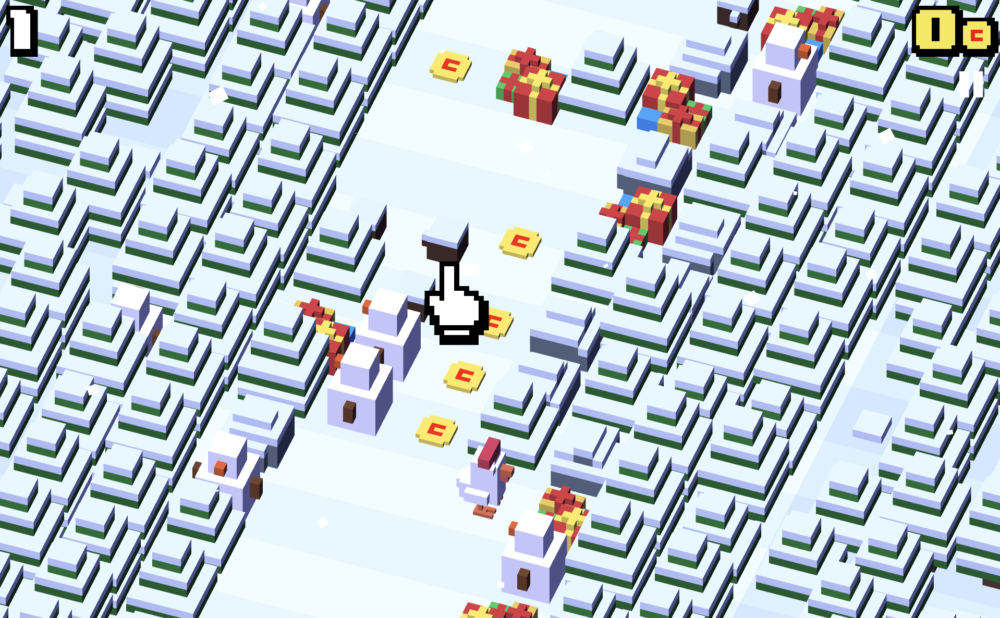

 

**Possible Challenges**
1. Complex State Management: Balancing the player's three stats (Stamina/Mood/Time) alongside the "Hold-to-Interact" logic requires a sophisticated Finite State Machine (FSM).
2. UI/UX in Canvas Environment: Creating a responsive HUD for stats and floating interaction bars requires writing a custom UI Manager class from scratch.

**Links**
* [Road Fighter (Retro Games)](https://www.retrogames.cz/play_065-NES.php)
* [Crossy Road Official](https://crossy-road.io/cross-road)

---

## Game 3: Balatro (Tarot Edition)
**Game Type:** Roguelike Card Game

**Game Prototype**
Balatro

**Game Description**
A roguelike game based on playing cards. 
* Main mechanics: Players play poker hands to earn points; clearing the stage once the target is reached.
* Progression: Three rounds make up a major stage.
* Economy: Use reward coins to buy buffs (Jester cards) at the end of each round.

**Additional Ideas**
* Re-skin using Tarot cards with elemental suits (Wands, Cups, Coins, Swords).
* Element effects: Pair of Cups + Coins doubles points; Wands + Cups halves them.
* Major Arcana cards replace Jester cards (e.g., The Tower grants double points for the next Earth card).
* Reduce rounds per run to 3–6.

 

  <b>Game Start Interface</b> 
  

 

  <b>Gameplay Interface</b> 
   
  

 

  <b>Scoring Display</b> 
  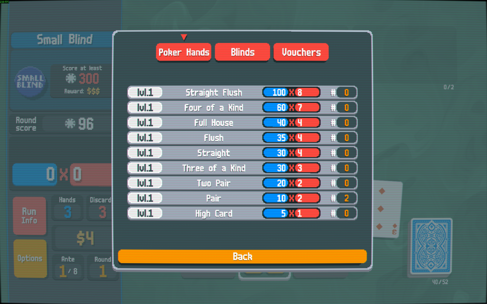

 

  <b>Shop Page</b> 
  

 

**Possible Challenges**
1. Hand score algorithm with element reactions.
2. Backend state tracking for deck and scoring.
3. Managing random shop and hand order.

**Links**
* [Balatro on Steam](https://store.steampowered.com/app/2379780/Balatro/)
* [Balatro Gameplay Video](https://youtu.be/2n9pkiuSZLU)

---

## Game 4: Pico Park
**Game Type:** Cooperative Puzzle-Platformer

**Game Prototype**
Pico Park

**Game Description**
A multiplayer cooperative jumping/platforming game with synchronization-based mechanisms.

**Additional Ideas**
* Unique character abilities: jumping farther, pushing blocks, creating temporary steps.

 

  <b>Start Page (Multiplayer Lobby)</b> 
  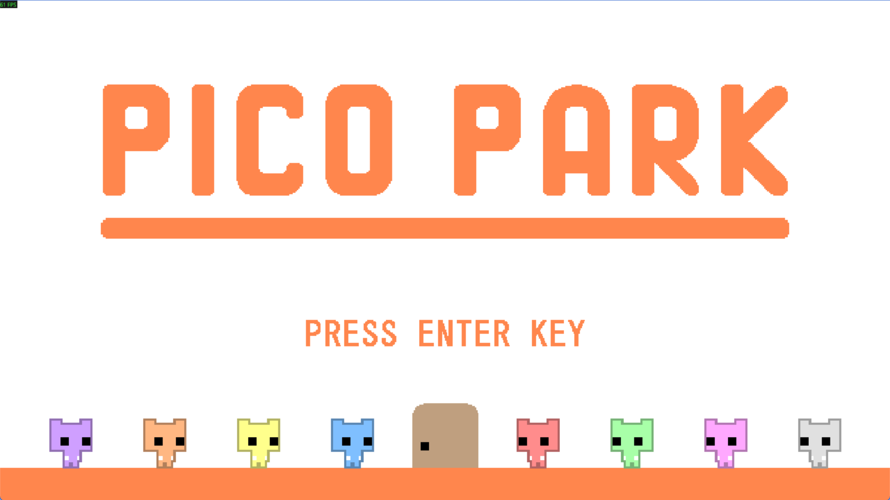

 

  <b>Gameplay Interface (Level Mechanisms)</b> 
  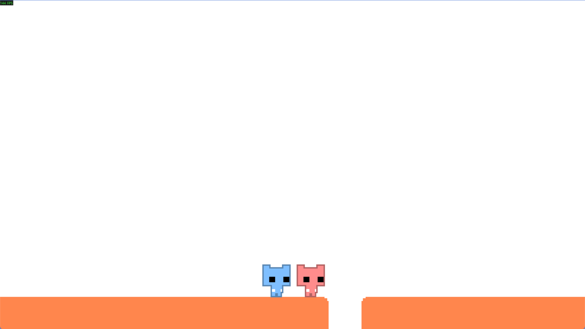 
  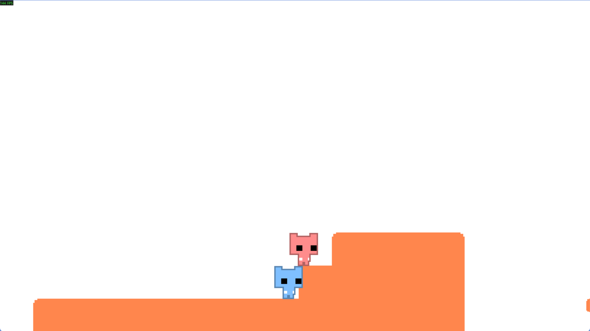 
  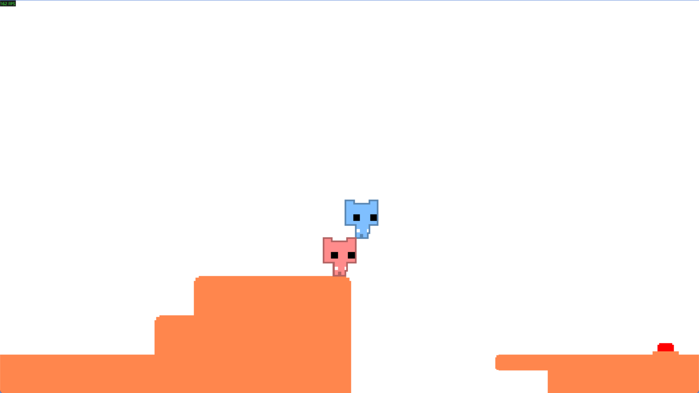

 

**Possible Challenges**
1. Input synchronization for multiple players and physics collisions.
2. Designing modular interactive level elements (switches, platforms).

**Links**
* [Pico Park Official](https://picoparkgame.com/pp1/)

---

## Game 5: Flappy Bird (360° Edition)
**Game Type:** Arcade

**Game Prototype**
Flappy Bird

**Game Description**
Standard bird navigation through horizontal gaps.

**Added Ideas**
* Introduces 360-degree freedom. Players control movement on both X and Y axes with sophisticated acceleration.

 

  <b>Flappy Bird Screenshot (Core Loop Inspiration)</b> 
  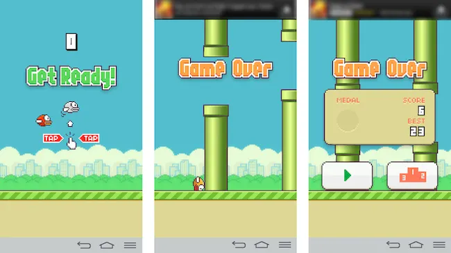

 

**Possible Challenges**
1. Camera System and coordinate transformation.
2. Modularity in scoring.

---

## Game 6: Super Mario Bros
**Game Type:** 2D Platformer

**Game Prototype**
Super Mario Bros

**Game Description**
Iconic platforming: leap, collect, stomp, and reach the finish.

 

  <b>Super Mario Bros - Level Design</b> 
  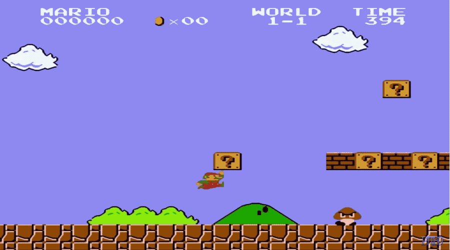

 

  <b>Super Mario Bros - Gameplay Mechanics</b> 
  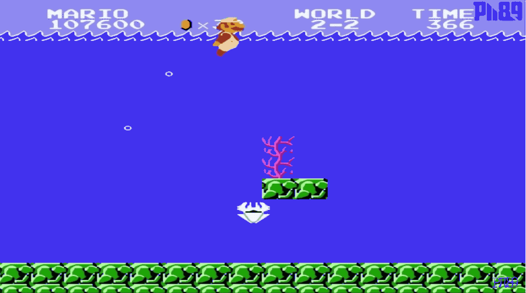

 

---

## Game 7: Tableturf Battle
**Game Type:** Turn-based Strategy, Puzzle, Deck-building

**Game Prototype**
Tableturf Battle (from Splatoon 3)

**Game Description**
Grid competition to fill areas with Tetris-shaped blocks connecting to existing color.

 

  <b>Tableturf Battle Screenshot (Grid Strategy)</b> 
  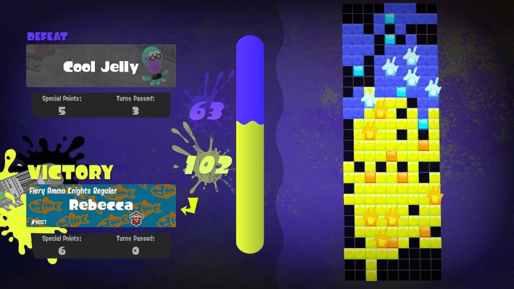

 

**Possible Challenges**
1. Intelligent AI Opponent.
2. Complex boundary decision graph algorithms.

**Links**
* [Tableturf Battle Gameplay](https://www.youtube.com/watch?v=a3UmoODEjis)

---

## Game 8: Tower at the End
**Game Type:** 2D Cooperative Puzzle Adventure

**Game Prototype**
Fireboy and Watergirl, FEZ

**Core Gameplay**
* Asymmetric Cooperation: paths or objects only accessible by one player.
* Mechanic-Based Level Design: Gravity inversion, visibility toggles, temporal switches.

**Added Ideas**
* Rule-Switching Tower: each level is a rule experiment.
* Emotional Storytelling: ruins, lighting, and sound narrative.

 

  <b>Fireboy and Watergirl (Asymmetric Cooperation Reference)</b> 
  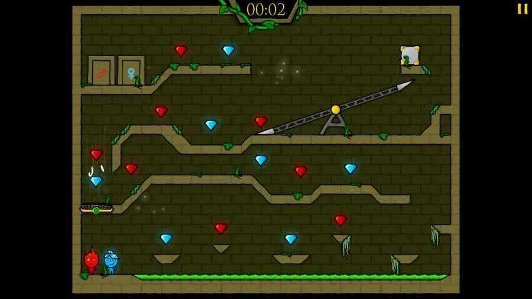

 

  <b>FEZ (World Perception & Mechanic Shift Reference)</b> 
  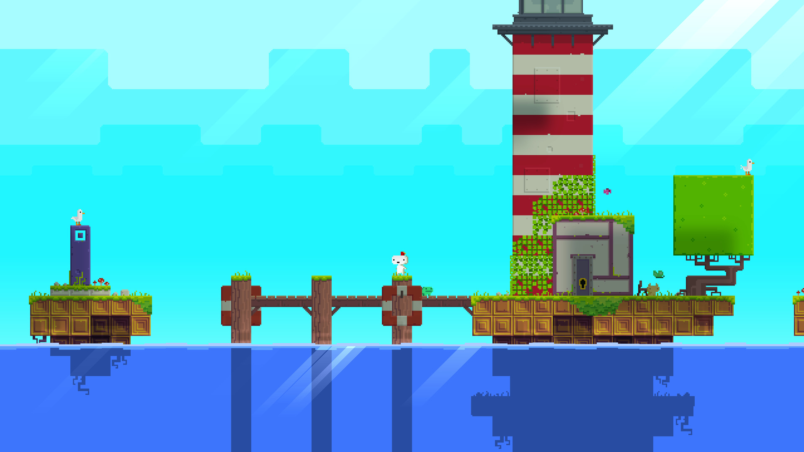

 

**Possible Challenges**
1. Rule State Management and clean transitions.
2. Logically consistent two-player synchronization.

**Links**
* [Fireboy and Watergirl](https://fireboyandwatergirl.run/)
* [FEZ Gameplay](https://www.youtube.com/watch?v=JkEKAi2jaaE)

---

## Game 9: The Strongest Support
**Game Type:** 2D Strategy, Indirect Control

**Game Prototype**
Monolith, Lemmings

**Core Gameplay**
* Indirect Control: Player controls a support monster to protect an AI-driven hero NPC.
* Periodic Skill Activation: Fixed-cycle skills where positioning determines agency.
* AI hero moves autonomously; player protects from incoming threats.

**Added Ideas**
* Indirect-Control Strategy Loop for planning and spatial reasoning.
* Character-as-Mechanic: each monster is a living game mechanic.

 

  <b>Monolith (Pixel-art Style Reference)</b> 
  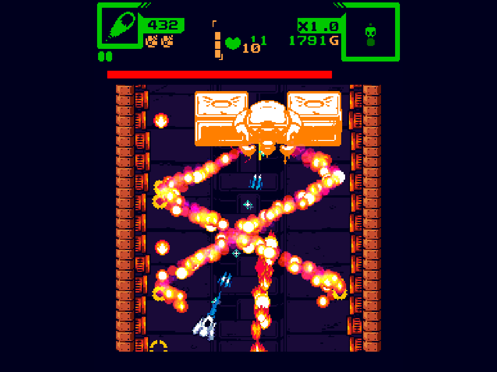

 

  <b>Lemmings (Indirect Control Reference)</b> 
  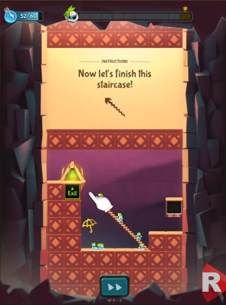

 

**Possible Challenges**
1. AI Behaviour Coordination for hero and enemies.
2. Timed Skill state management.

**Links**
* [Monolith Demo](https://team-d-13.itch.io/monolithdemo)
* [Lemmings Gameplay](https://www.youtube.com/watch?v=OjUYW1WBWFI)

---

## Game 10: Plants vs. Zombies (Icefield Mode)
**Game Type:** Tower Defense / Strategy

**Game Prototype**
Plants vs. Zombies

**Game Description**
Classic grid-based lane defense.

**Added Ideas - Icefield Mode**
* Polar Day/Night Cycle: Day (+20% production); Night (high speed zombies).
* Aurora Events: Green aurora empowers plants; Pink empowers zombies.
* New Units: Frost Pine, Glacier Prism Shooter, Aurora Spike Vine.

 

  <b>Plants vs. Zombies (Core Lane-Defense Reference)</b> 
  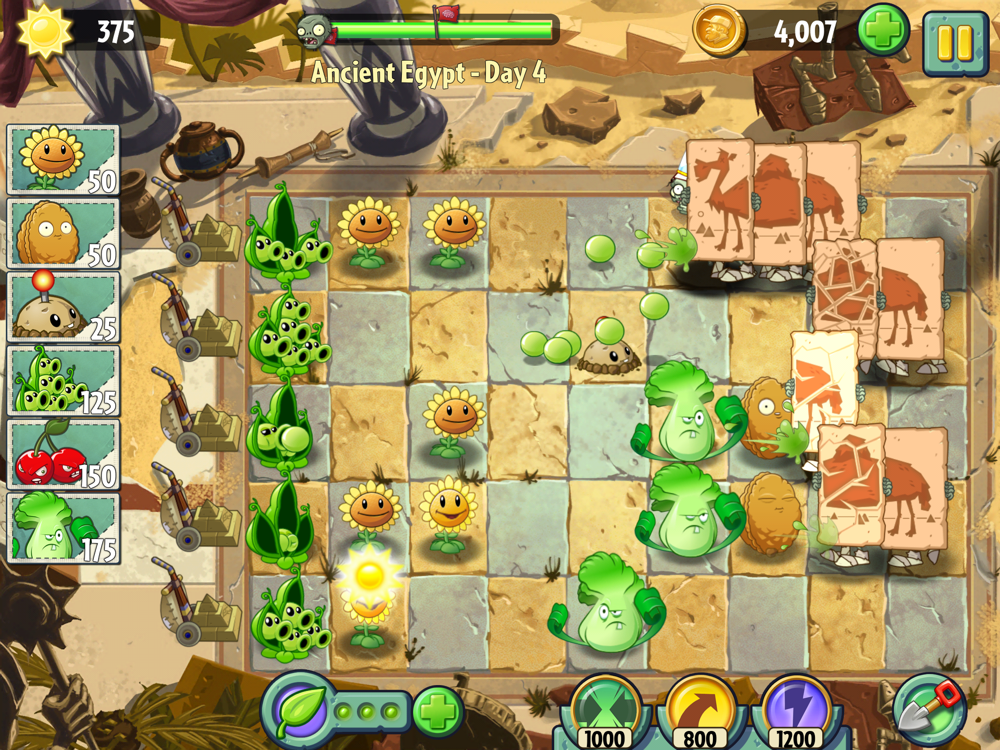

 

**Possible Challenges**
1. Multi-System Coupling (visibility, terrain, cycle).
2. Complex State systems for unit interaction.

**Links**
* [Plants vs. Zombies Official](https://www.ea.com/games/plants-vs-zombies)

---

## Game 11: Craft & Life
**Game Type:** Sandbox / Life Simulation

**Game Prototype**
Minecraft, Stardew Valley

**Game Description**
Open-world voxel building with structured farming and social interaction.

**Added Ideas**
* World Memory System: persistent evolving history based on player actions.
* Behavior-Based Identity: NPC attitudes adapt to the player's lifestyle choice.

 

  <b>Minecraft (Voxel Building Reference)</b> 
  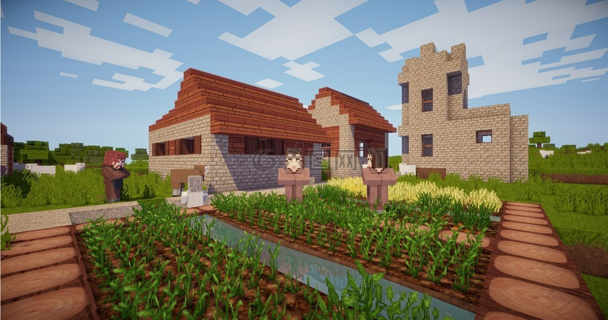

 

  <b>Stardew Valley (Farming & Social Reference)</b> 
  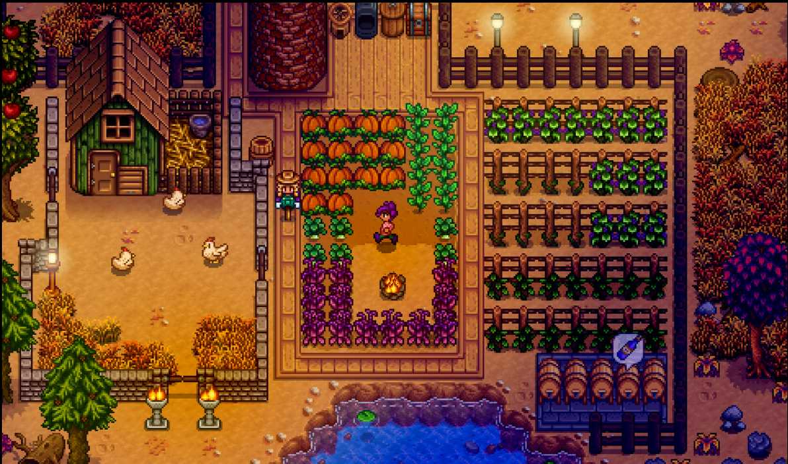

 

**Possible Challenges**
1. Persistent world management and damage archive.
2. Voxel world performance under heavy modification.

**Links**
* [Minecraft Official](https://www.minecraft.net/)
* [Stardew Valley Official](https://www.stardewvalley.net/)

---

**[ Back to Project Home ](../../../README.md)**

