# Park Street Survivor — Class Diagram

> Paste the Mermaid block below into [mermaid.ai](https://mermaid.ai) to render.

```mermaid
classDiagram

    class SketchCore {
        <<Engine>>
        +int currentDayID
        +bool developerMode
        +Object assets
        +Object fonts
        +setup() void
        +draw() void
        +preload() void
        +keyPressed() void
        +mousePressed() void
        +mouseDragged() void
        +mouseReleased() void
        +triggerTransition() void
        +drawWarningIcon() void
        +togglePause() void
        +setupRun() void
        +renderGlobalFade() void
    }
    note for SketchCore "Global draw-loop, asset loading, input routing\nand scene orchestration for the entire game"

    class GameState {
        <<StateMachine>>
        +int currentState
        +String failReason
        +bool isFirstTimeInRoom
        +setState() void
        +resetFlags() void
    }
    note for GameState "FSM driving all scene transitions via integer\nstate constants (STATE_MENU → STATE_INVENTORY)"

    class MainMenu {
        <<MenuController>>
        +int menuState
        +int helpPage
        +TimeWheel timeWheel
        +Array buttons
        +UISlider bgmSlider
        +UISlider sfxSlider
        +int difficultyIndex
        +Array _helpControls
        +Array _helpBuffs
        +Array _helpHazards
        +display() void
        +drawHomeScreen() void
        +drawSelectScreen() void
        +drawSettingsScreen() void
        +drawHelpScreen() void
        +handleKeyPress() void
        +handleClick() void
        +cycleDifficulty() void
        +toggleBGMMute() void
        +toggleSFXMute() void
    }
    note for MainMenu "Renders all menu screens: home, level-select,\nsettings (audio + difficulty), 4-page help, and credits"

    class TimeWheel {
        <<LevelSelector>>
        +int selectedDay
        +int totalDays
        +bool isEntering
        +float bgAlpha
        +Array _drops
        +Object _cloudDrop
        +float _cloudScale
        +display() void
        +triggerEntrance() void
        +handleInput() void
        +renderCloudPreview() void
        +drawNavNode() void
        +drawDynamicBackground() void
        +drawSelectionArrows() void
        +drawMissionTitle() void
        +_updateDropPhysics() void
    }
    note for TimeWheel "Persona-5 sidebar day navigator with per-card\nstaggered physics drop-in and cloud floating animation"

    class UIButton {
        <<UIComponent>>
        +float x
        +float y
        +float w
        +float h
        +String label
        +float currentScale
        +bool isFocused
        +update() void
        +display() void
        +checkMouse() bool
        +handleClick() void
    }
    note for UIButton "Reusable button with smooth lerp scale hover feedback\nand BACK_ARROW vector icon support"

    class UISlider {
        <<UIComponent>>
        +float x
        +float y
        +float w
        +float value
        +String label
        +bool isDragging
        +display() void
        +update() void
        +handlePress() void
        +handleRelease() void
    }
    note for UISlider "Volume control slider with drag-knob interaction\nfor BGM and SFX level adjustment"

    class RoomScene {
        <<Scene>>
        +float playerSpawnX
        +float playerSpawnY
        +Object walkableArea
        +Object carpetArea
        +float deskX
        +float deskY
        +float doorX
        +float doorY
        +bool isPlayerNearDesk
        +bool isPlayerNearDoor
        +int doorBlockTimer
        +UIButton backButton
        +reset() void
        +isWalkable() bool
        +getValidPosition() Object
        +checkInteraction() void
        +handleKeyPress() void
        +display() void
        +drawInteractionIndicators() void
        +drawTutorialHints() void
        +drawDoorBlockedPrompt() void
        +drawRoomDevTools() void
    }
    note for RoomScene "Bedroom scene: axis-separated collision, desk and door\nproximity detection, tutorial hint breathing icons"

    class BackpackVisual {
        <<InventoryUI>>
        +InventorySystem inventory
        +Array topSlots
        +Array scatteredItems
        +Object draggedItem
        +bool showReplaceDialog
        +String messageText
        +int messageTimer
        +int shimmer
        +UIButton backButton
        +display() void
        +drawTopBar() void
        +drawScatteredItems() void
        +drawTooltip() void
        +drawReplaceDialog() void
        +handleMousePressed() void
        +handleMouseDragged() void
        +handleMouseReleased() void
        +tryAddToBackpack() void
        +executeReplace() void
        +hasRequiredItems() bool
        +getMissingRequiredItems() Array
        +showMessage() void
    }
    note for BackpackVisual "Drag-and-drop inventory panel: pack items from desk\ninto backpack slots, swap dialog, tooltips, dev overlays"

    class InventorySystem {
        <<DataStore>>
        +Array items
        +int maxSlots
        +bool isVisible
        +addItem() bool
        +display() void
        +drawSlots() void
        +handleKeyPress() void
    }
    note for InventorySystem "Lightweight item data store with slot-based capacity\nmanagement and basic full-screen slot display"

    class Player {
        <<Entity>>
        +float x
        +float y
        +float health
        +float maxHealth
        +float baseSpeed
        +float healthDecay
        +float distanceRun
        +int playTimeFrames
        +int carHitCount
        +String dir
        +bool isWalking
        +float animFrame
        +update() void
        +display() void
        +takeDamage() void
        +triggerGameOver() void
        +handleRunMovement() void
        +handleRoomMovement() void
        +drawTopBar() void
        +drawClock() void
        +drawHealthBar() void
        +drawProgressBar() void
        +drawPauseIcon() void
        +resetStatsToDefault() void
        +applyLevelStats() void
    }
    note for Player "Player physics, survival metrics (health/stamina/time),\nwalk-cycle animation, and real-time HUD rendering"

    class Environment {
        <<WorldRenderer>>
        +float scrollPos
        +int bgHeight
        +int centerX
        +Object layout
        +Object colors
        +Object victoryColors
        +update() void
        +display() void
        +loadBackgrounds() void
        +drawCenterLine() void
    }
    note for Environment "2-2-2 road layout renderer with scrolling background,\nlane markings, and victory-zone transition rendering"

    class ObstacleManager {
        <<ObstacleSystem>>
        +Array obstacles
        +int spawnTimer
        +update() void
        +display() void
        +checkCollision() void
        +stopSpawning() void
    }
    note for ObstacleManager "Spawns and manages road obstacles (cars, buses, scooters,\nNPCs), checks per-frame collision with the player"

    class LevelController {
        <<LevelLifecycle>>
        +ProceduralLevel proceduralLevel
        +ProceduralLevel currentLevel
        +int currentDayID
        +String levelType
        +String levelPhase
        +float victoryStartScrollPos
        +int victoryZoneFrames
        +float victoryZoneStartY
        +initializeLevel() void
        +loadLevelBackgrounds() void
        +initializeProceduralLevel() void
        +applyDifficultyParameters() void
        +triggerVictoryPhase() void
        +getLevelPhase() String
        +update() void
        +display() void
    }
    note for LevelController "Orchestrates level lifecycle: day routing, difficulty params,\nRUNNING → VICTORY_TRANSITION → VICTORY_ZONE phases"

    class ProceduralLevel {
        <<LevelConfig>>
        +int dayID
        +Object config
        +String levelText
        +int frameCounter
        +int displayDuration
        +setup() void
        +update() void
        +display() void
        +reset() void
        +cleanup() void
    }
    note for ProceduralLevel "Per-day procedural level: frame-based logic,\ndistance and victory checking, level text overlay"

    class EndScreenBase {
        <<Abstract>>
        +int selectedIndex
        +Array options
        +bool isActive
        +String stateStep
        +activate() void
        +drawOverlay() void
        +drawBox() void
        +drawProgressBar() void
        +drawButtons() void
        +handleKeyPress() void
        +handleClick() void
        +handleMouseMove() void
        +executeSelection() void
    }
    note for EndScreenBase "Abstract base: shared semi-transparent overlay, central box,\nprogress bar, and navigation button rendering"

    class FailScreen {
        <<EndScreen>>
        +String failType
        +Array mainOptions
        +Array modeOptions
        +display() void
        +_getReasonText() String
        +executeSelection() void
    }
    note for FailScreen "Game-over screen showing reason-specific message\n(HIT_BUS / EXHAUSTED / LATE) with retry or menu prompt"

    class SuccessScreen {
        <<EndScreen>>
        +Array mainOptions
        +Array modeOptions
        +display() void
        +executeSelection() void
    }
    note for SuccessScreen "Day-complete screen: displays hit-count summary,\nunlocks next day, offers continue or restart"

    class EndScreenManager {
        <<Manager>>
        +Object failScreens
        +SuccessScreen successScreen
        +activateFail() void
        +activateSuccess() void
        +display() void
        +handleKeyPress() void
        +handleClick() void
        +handleMouseMove() void
    }
    note for EndScreenManager "Routes display and input to the correct FailScreen variant\nor SuccessScreen based on game result"

    %% ── Inheritance ──────────────────────────────────────
    FailScreen --|> EndScreenBase
    SuccessScreen --|> EndScreenBase

    %% ── Composition (owner *-- part) ─────────────────────
    MainMenu *-- TimeWheel
    MainMenu *-- UIButton
    MainMenu *-- UISlider
    EndScreenManager *-- FailScreen
    EndScreenManager *-- SuccessScreen
    LevelController *-- ProceduralLevel
    RoomScene *-- UIButton
    BackpackVisual *-- UIButton

    %% ── Association / Dependency ─────────────────────────
    SketchCore --> GameState
    SketchCore --> MainMenu
    SketchCore --> Player
    SketchCore --> Environment
    SketchCore --> ObstacleManager
    SketchCore --> LevelController
    SketchCore --> RoomScene
    SketchCore --> EndScreenManager
    SketchCore --> BackpackVisual
    SketchCore --> InventorySystem
    BackpackVisual --> InventorySystem
    BackpackVisual --> RoomScene
    Player --> LevelController
    LevelController --> ObstacleManager
    LevelController --> Environment

    %% ── Macaron Pastel Colour Palette ────────────────────
    classDef engine     fill:#FADADD,stroke:#FF85A1,color:#5a0020
    classDef state      fill:#E8D5F5,stroke:#B57FE8,color:#3a0060
    classDef menu       fill:#FFF0C0,stroke:#F0C040,color:#4a3000
    classDef component  fill:#FFD7BA,stroke:#FFA07A,color:#5a2000
    classDef scene      fill:#B5EAD7,stroke:#52B89A,color:#003828
    classDef gameplay   fill:#AED9E0,stroke:#4BAEC8,color:#003040
    classDef data       fill:#D4C5F9,stroke:#9B7FE8,color:#2a0055
    classDef endscreen  fill:#FFB5A7,stroke:#FF6B6B,color:#5a1000

    class SketchCore engine
    class GameState state
    class MainMenu menu
    class TimeWheel menu
    class UIButton component
    class UISlider component
    class RoomScene scene
    class BackpackVisual scene
    class InventorySystem data
    class Player gameplay
    class Environment gameplay
    class ObstacleManager gameplay
    class LevelController gameplay
    class ProceduralLevel gameplay
    class EndScreenBase endscreen
    class FailScreen endscreen
    class SuccessScreen endscreen
    class EndScreenManager endscreen
```

---

## 色彩图例

| 颜色 | 色系 | 包含类 |
|------|------|--------|
| 🌸 粉红 | Engine | SketchCore |
| 💜 薰衣草 | StateMachine | GameState |
| 🌼 奶黄 | Menu/UI | MainMenu, TimeWheel |
| 🍑 蜜桃 | UIComponent | UIButton, UISlider |
| 🍃 薄荷 | Scene | RoomScene, BackpackVisual |
| 🩵 天蓝 | Gameplay | Player, Environment, ObstacleManager, LevelController, ProceduralLevel |
| 🫐 淡紫 | DataStore | InventorySystem |
| 🍓 珊瑚 | EndScreen | EndScreenBase, FailScreen, SuccessScreen, EndScreenManager |
